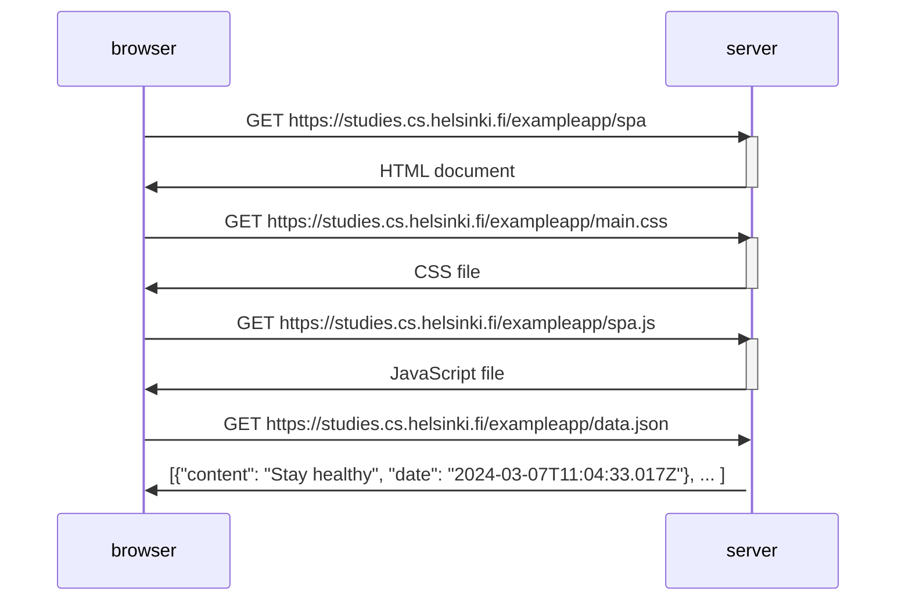

```mermaid
sequenceDiagram
    participant browser
    participant server

    browser ->>server: GET https://studies.cs.helsinki.fi/exampleapp/spa
    activate server
    server ->>browser: HTML document
    deactivate server

    browser ->>server: GET https://studies.cs.helsinki.fi/exampleapp/main.css 
    activate server
    server ->> browser: CSS file
    deactivate server

    browser ->>server: GET https://studies.cs.helsinki.fi/exampleapp/spa.js
    activate server
    server ->>browser: JavaScript file
    deactivate server

    browser ->> server: GET https://studies.cs.helsinki.fi/exampleapp/data.json
    activate server
    server ->> browser: [{"content": "Stay healthy", "date": "2024-03-07T11:04:33.017Z"}, ... ]
```